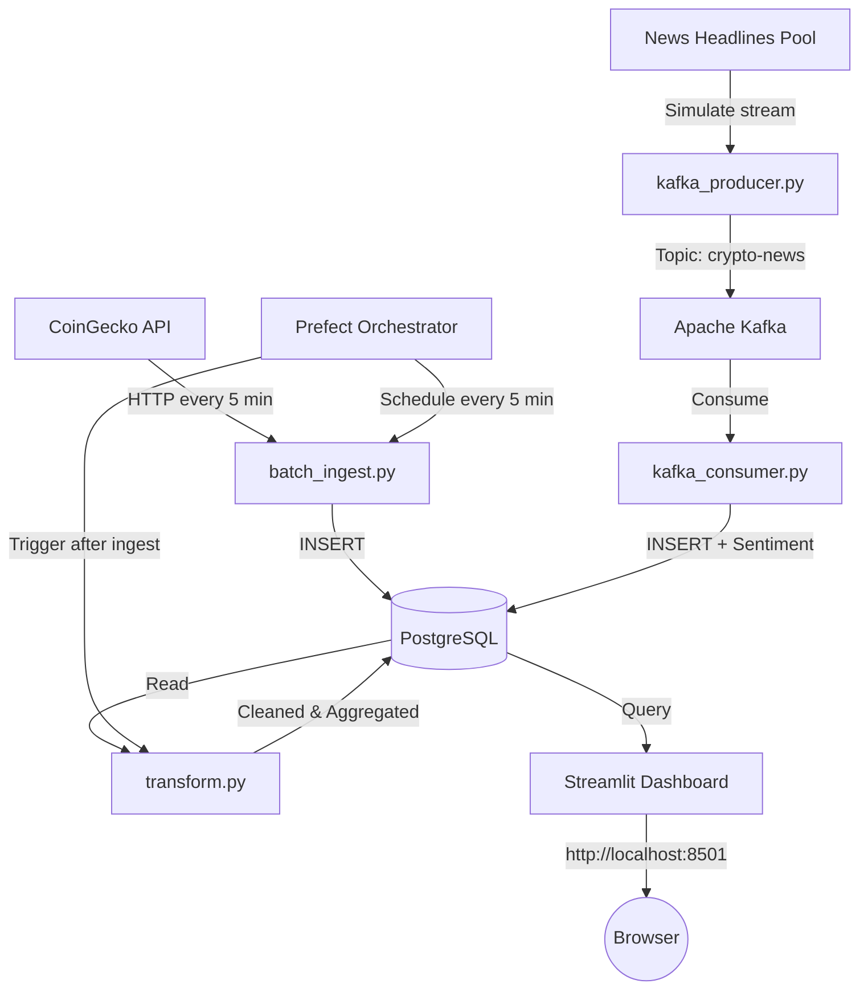

# Crypto & News Analytics Data Pipeline

> An end-to-end data engineering pipeline built with Python, PostgreSQL, Apache Kafka, Prefect, and Streamlit.

## Overview

This project implements a production-style data pipeline that:
- **Fetches** live cryptocurrency prices from the CoinGecko public API (batch, scheduled)
- **Streams** crypto news headlines through Apache Kafka (real-time)
- **Stores** all data in PostgreSQL with a structured schema
- **Transforms** and enriches data using Pandas (dedup, null cleaning, sentiment, aggregations)
- **Orchestrates** the pipeline with Prefect (scheduling, retries, task dependencies)
- **Visualises** results in a Streamlit interactive dashboard

## Tech Stack

| Component | Technology |
|---|---|
| Batch Ingestion | Python + Requests (CoinGecko API) |
| Streaming | Apache Kafka + kafka-python |
| Storage | PostgreSQL 15 |
| Transformation | Pandas + TextBlob |
| Orchestration | Prefect 2.x |
| Dashboard | Streamlit + Plotly |
| Infrastructure | Docker Compose |
| Testing | pytest |

## Architecture



## Quick Start

### Prerequisites

- Python 3.10 or 3.11
- Docker Desktop (with Docker Compose v2)
- Git

### 1. Clone and set up

```bash
git clone <your-repo-url>
cd crypto-pipeline
python -m venv venv && source venv/bin/activate
pip install -r requirements.txt
python -m textblob.download_corpora
cp .env.example .env
```

### 2. Start infrastructure

```bash
docker compose up -d postgres zookeeper kafka
```

### 3. Run the pipeline

```bash
# Terminal 1 — Prefect orchestration (ingestion + transformation, every 5 min)
python -m orchestration.flow

# Terminal 2 — Kafka news producer
python -m ingestion.kafka_producer

# Terminal 3 — Kafka news consumer
python -m ingestion.kafka_consumer

# Terminal 4 — Dashboard
streamlit run dashboard/app.py
```

Open **http://localhost:8501** in your browser.

### 4. Run tests

```bash
pytest tests/ -v
```

## Project Structure

```
crypto-pipeline/
├── docker-compose.yml
├── requirements.txt
├── .env.example
├── database/        ← Schema + DB helpers
├── utils/           ← Config + Logger
├── ingestion/       ← Batch ingest + Kafka producer/consumer
├── transformation/  ← Pandas transformations
├── orchestration/   ← Prefect flow
├── dashboard/       ← Streamlit app
├── tests/           ← pytest test suite
└── diagrams/        ← Architecture diagram
```

## Data Sources

| Source | Type | Method | Data |
|---|---|---|---|
| CoinGecko API | Batch | HTTP GET every 5 min | Price, market cap, volume, 24h change |
| News Headlines | Stream | Kafka | Headline text, source, sentiment |

## Environment Variables

Copy `.env.example` to `.env`. Default values work for the local Docker setup.

| Variable | Default | Description |
|---|---|---|
| `POSTGRES_HOST` | `localhost` | PostgreSQL host |
| `POSTGRES_DB` | `crypto_db` | Database name |
| `KAFKA_BOOTSTRAP_SERVERS` | `localhost:9092` | Kafka broker |
| `KAFKA_TOPIC` | `crypto-news` | Topic for news |
| `COINGECKO_API_URL` | `https://api.coingecko.com/api/v3` | API base URL |

## License

MIT