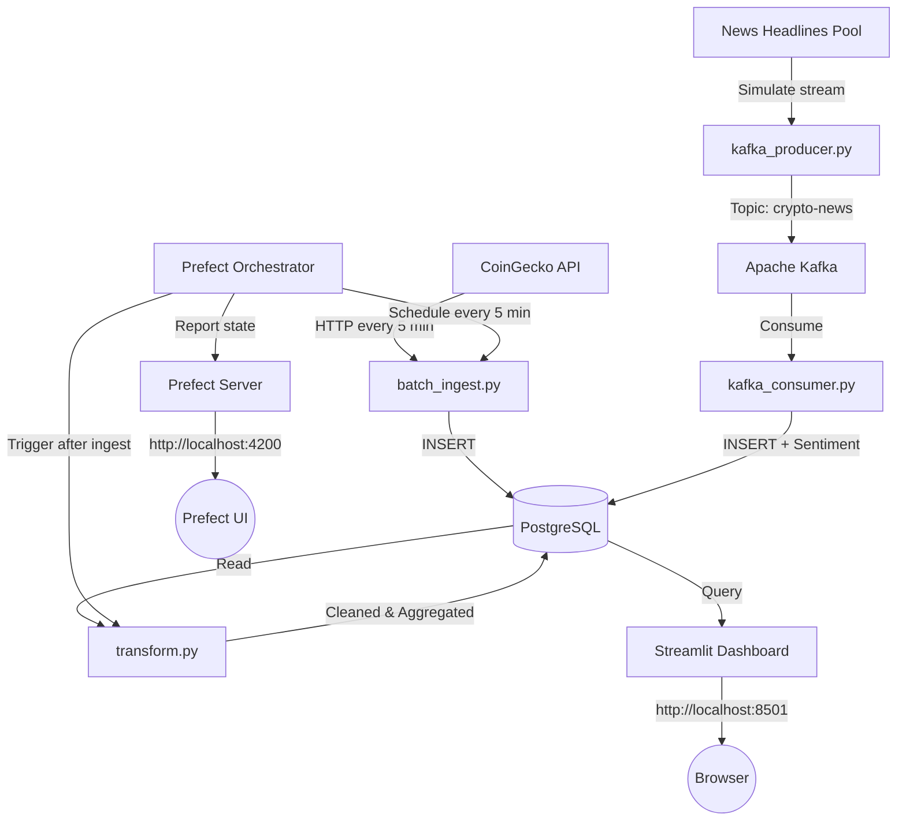

# Crypto & News Analytics Data Pipeline

> An end-to-end data engineering pipeline built with Python, PostgreSQL, Apache Kafka, Prefect, and Streamlit — fully containerised with Docker.

## Overview

This project implements a production-style data pipeline that:
- **Fetches** live cryptocurrency prices from the CoinGecko public API (batch, scheduled)
- **Streams** crypto news headlines through Apache Kafka (real-time)
- **Stores** all data in PostgreSQL with a structured schema
- **Transforms** and enriches data using Pandas (dedup, null cleaning, sentiment, aggregations)
- **Orchestrates** the pipeline with Prefect (scheduling, retries, task dependencies)
- **Visualises** results in a Streamlit interactive dashboard
- **Containerises** all services via Docker Compose for reproducible environments

## Tech Stack

| Component | Technology |
|---|---|
| Batch Ingestion | Python + Requests (CoinGecko API) |
| Streaming | Apache Kafka + kafka-python |
| Storage | PostgreSQL 15 |
| Transformation | Pandas + TextBlob |
| Orchestration | Prefect 2.x + Prefect Server |
| Dashboard | Streamlit + Plotly |
| Infrastructure | Docker Compose |
| Testing | pytest |

## Architecture



## Quick Start

### Prerequisites

- Docker Desktop (with Docker Compose v2)

All Python services run inside containers — no local Python or virtualenv required.

### 1. Clone and configure

```bash
git clone <your-repo-url>
cd crypto-pipeline
cp .env.example .env
```

### 2. Build and start everything

```bash
docker compose up --build
```

This starts all 8 services:

| Service | Purpose | Port |
|---|---|---|
| `postgres` | Database | 5432 |
| `zookeeper` | Kafka coordinator | 2181 |
| `kafka` | Message broker | 9092 |
| `streamlit` | Analytics dashboard | 8501 |
| `kafka-producer` | News headline producer | — |
| `kafka-consumer` | News consumer + sentiment | — |
| `orchestrator` | Prefect scheduled pipeline | — |
| `prefect-server` | Prefect UI + API | 4200 |

### 3. Open the interfaces

| URL | What |
|---|---|
| http://localhost:8501 | Streamlit dashboard |
| http://localhost:4200 | Prefect Server UI (flow runs, task status, retries) |

### 4. Run tests

```bash
docker compose run --rm orchestrator pytest tests/ -v
```

## Project Structure

```
crypto-pipeline/
├── Dockerfile              ← Reusable Python image for all services
├── .dockerignore           ← Prevents secrets and cache from entering images
├── docker-compose.yml      ← All 8 services with healthchecks and networking
├── requirements.txt        ← Python dependencies
├── .env.example            ← Template with Docker-optimised defaults
├── .env                    ← Local secrets (gitignored)
├── database/               ← SQL schema + DB connection helpers
│   ├── init.sql
│   └── db.py
├── utils/                  ← Shared utilities
│   ├── config.py           ← Centralised env-var loading
│   └── logger.py           ← Structured JSON logger
├── ingestion/              ← Data ingestion modules
│   ├── batch_ingest.py     ← CoinGecko API fetcher (exponential backoff)
│   ├── kafka_producer.py   ← Simulated news stream producer
│   └── kafka_consumer.py   ← News consumer + TextBlob sentiment
├── transformation/         ← Pandas transformations
│   └── transform.py        ← Dedup, null cleaning, aggregation, sentiment metrics
├── orchestration/          ← Prefect 2.x workflow
│   └── flow.py             ← Task dependencies, retries, scheduled deployment
├── dashboard/              ← Streamlit + Plotly
│   └── app.py              ← Live KPIs, charts, sentiment, aggregations
├── tests/                  ← pytest suite
│   ├── test_quality.py
│   └── test_transformations.py
└── diagrams/
    └── architecture.png
```

## Environment Variables

Copy `.env.example` to `.env`. Defaults are pre-configured for Docker networking.

| Variable | Default (Docker) | For local dev, change to |
|---|---|---|
| `POSTGRES_HOST` | `postgres` | `localhost` |
| `POSTGRES_PORT` | `5432` | `5432` |
| `POSTGRES_DB` | `crypto_db` | — |
| `POSTGRES_USER` | `postgres` | — |
| `POSTGRES_PASSWORD` | `postgres123` | — |
| `KAFKA_BOOTSTRAP_SERVERS` | `kafka:29092` | `localhost:9092` |
| `KAFKA_TOPIC` | `crypto-news` | — |
| `COINGECKO_API_URL` | `https://api.coingecko.com/api/v3` | — |
| `BATCH_INTERVAL_SECONDS` | `300` | — |

## Docker Networking

All services communicate over the internal Docker bridge network using service names:

| Service | Internal address |
|---|---|
| PostgreSQL | `postgres:5432` |
| Kafka (internal) | `kafka:29092` |
| Kafka (host) | `localhost:9092` |
| Prefect API | `http://prefect-server:4200/api` |

## Useful Commands

```bash
# View running containers
docker compose ps

# Follow logs for a specific service
docker compose logs -f kafka-consumer

# Run the pipeline once (no schedule)
docker compose run --rm orchestrator python -m orchestration.flow --once

# Tear down (preserves DB volume)
docker compose down

# Full cleanup (deletes DB data)
docker compose down -v
```

## Data Sources

| Source | Type | Method | Data |
|---|---|---|---|
| CoinGecko API | Batch | HTTP GET every 5 min | Price, market cap, volume, 24h change |
| News Headlines | Stream | Kafka (3s interval) | Headline text, source, sentiment |

## UTF-8 & Encoding

All Python containers set `PYTHONIOENCODING=utf-8` and `PYTHONUNBUFFERED=1` at build time, ensuring consistent text handling across every service.

## License

MIT
